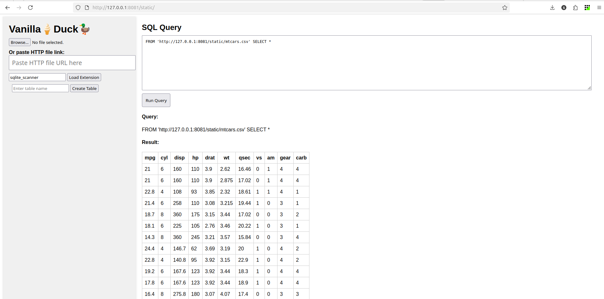

# duckdb-wasm-html-js-simple

A fork to distribute the DuckDB-Wasm HTML/JS demo as an R package, serving static files via Go HTTP server (goserveR).

## Installation

```r
remotes::install_github("sounkou-bioinfo/duckdb-wasm-html-js-simple", ref = "rServe")
```

## Demo: Run the Server

```r
library(duckdbWasmHtmlJsSimple)
server()
```

- Serves files from `inst/static` in the current directory at `127.0.0.1:8081/static/`
- Automatically creates `mtcars.csv` in `inst/static` and deletes it on exit
- Supports range requests and CORS

## Example



## Function Reference

### `server()`

Serve static files from `inst/static` using Go HTTP server via goserveR.

**Arguments:**
- `static_dir`: Directory to serve (default: `inst/static` in current working directory)
- `goserver_addr`: Address to bind the server (default: `127.0.0.1:8081`)
- `prefix`: URL prefix for served files (default: `/static`)

**Details:**
- Creates `mtcars.csv` in the static directory
- Cleans up `mtcars.csv` on exit
- Blocking call; stops on Ctrl+C or ESC

## License
MIT
