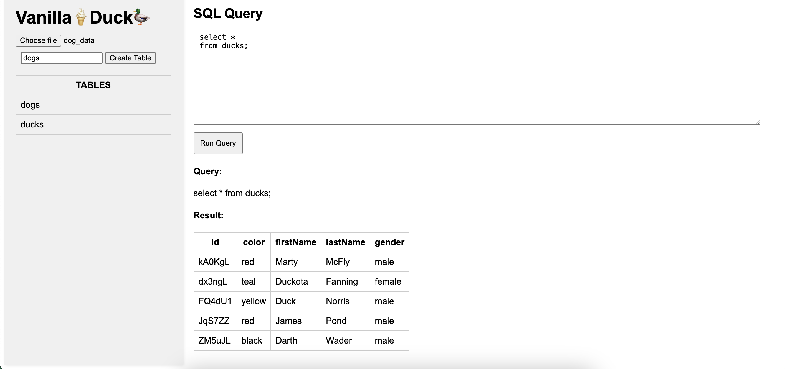

A simple implementation of DuckDB-Wasm using vanilla JS.

# Static Assets

This folder contains static files served by the Go HTTP server via goserveR.

- `mtcars.csv` is auto-generated for DuckDB-Wasm demo purposes.
- You can add other files here to make them available via HTTP.
